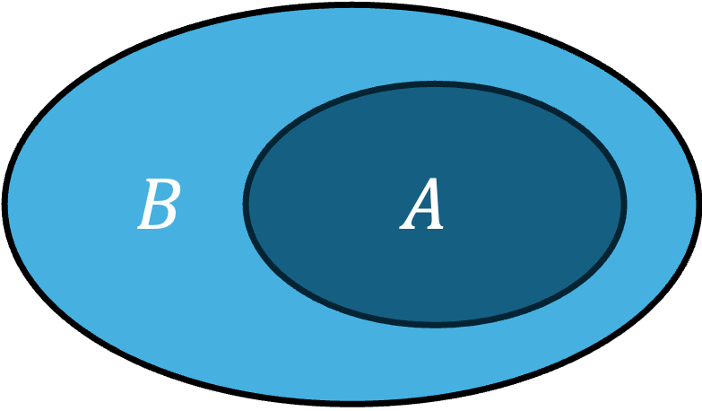
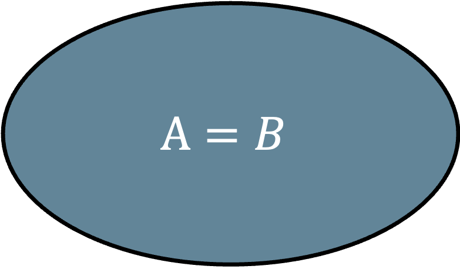
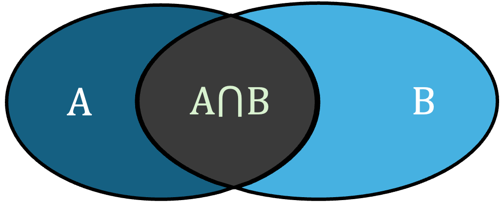
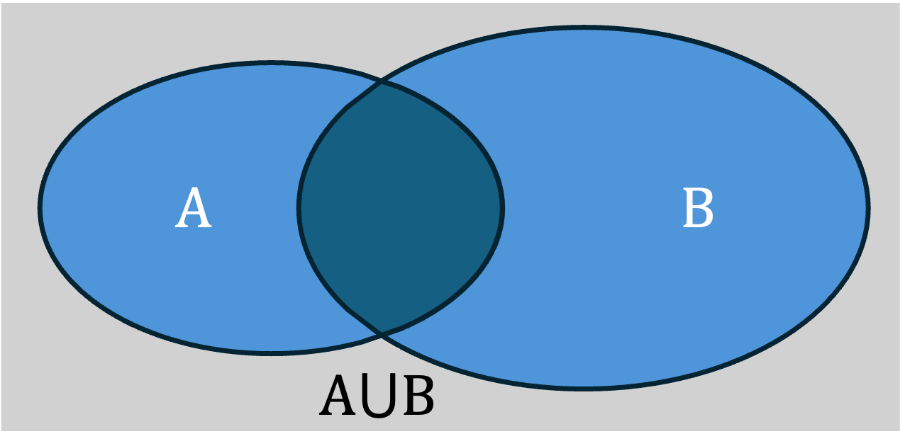
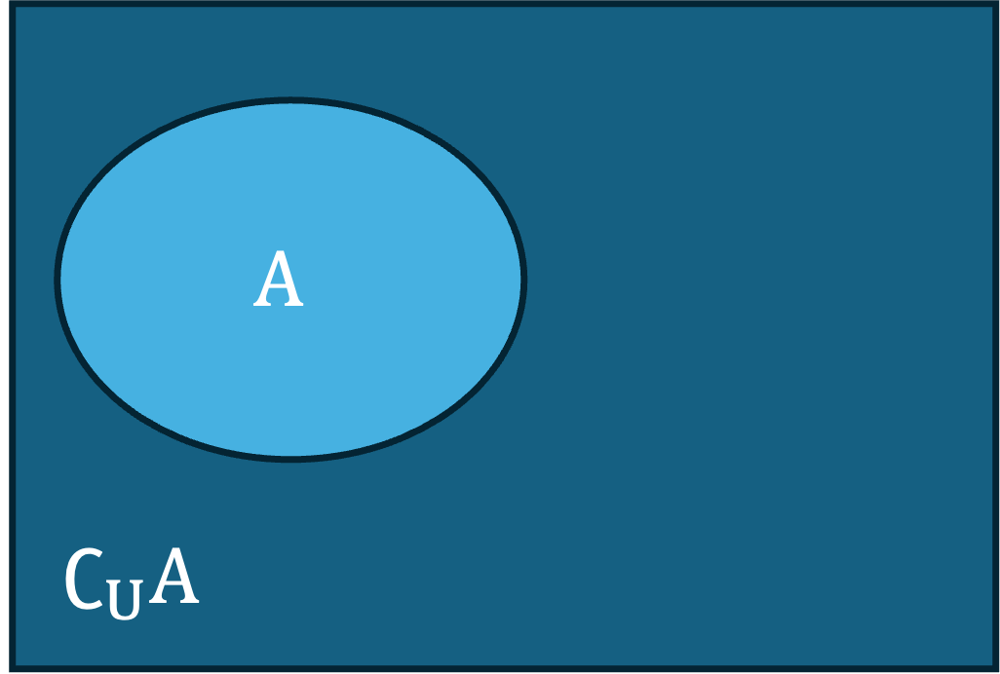

- [1 集合的概念](#1-集合的概念)
  - [1.1 概念](#11-概念)
  - [1.2 三要素](#12-三要素)
  - [1.3 集合的表示](#13-集合的表示)
  - [1.4 常见的几种集合](#14-常见的几种集合)
- [2 集合间的基本关系](#2-集合间的基本关系)
- [3 集合的基本运算](#3-集合的基本运算)
  - [3.1 交、并、补的定义](#31-交并补的定义)
  - [3.2 区间](#32-区间)
  - [3.3 常见的运算特性](#33-常见的运算特性)

### 1 集合的概念

#### 1.1 概念

集合：$\{$元素1，元素2，元素3，$\cdots\}$
把每一个要研究的对象称作**元素**，元素的**总体**叫做**集合**（简称**集**）

* 元素是多种多样的，一个点可以是集合中的元素，一个集合也可以是集合中的元素，例如：
$$\{(1,2),(3,4),(5,6)\}、\{\{1,2,3\}\,\{1,3,4\}\,\{2,3,5\}\}、\cdots$$
* 通常用大写英文字母$A,B,C,\cdots$表示集合，小写英文字母$a,b,c,\cdots$表示元素
* 没有任何元素的集合称为**空集**，记作：**$\varnothing$**
* 元素与集合存在**属于**或**不属于**关系，用符号 **$\in$** 或 **$\notin$** 表示。如元素$a$在集合$A$中，称为元素$a$属于集合$A$，写作：**$a\in A$**
* 若集合$A$和集合$B$中的**所有元素都相同**，则集合$A$和集合$B$**相等**，记为：**$A=B$**

#### 1.2 三要素

> 任意的元素组合起来都能成为一个集合呢？

* 确定性：集合中的元素是确定的，即一个给定的集合，元素属不属于该集合是确定的
* 互异性：集合中的元素是相互不同的，即集合中的任意元素都只会出现一次
* 无序性：集合中的元素没有先后顺序，例如：$\{1,2,3\}=\{3,1,2\}$

例题1.已知集合$\{a,b,c\}=\{0,1,2\}$，且下面三个关系：①$a\neq 2$，②$b=2$，③$c\neq 0$有且只有一个正确，则$100a+10b+c=\underline{\qquad\quad}$。

解：根据集合相等得$a，b，c$分别为$0，1，2$中的一个，且互不相等，又 ① ② ③ 三个关系只有一个正确，另外两个错误。
假设 ① 正确，则$a\neq2$，③ 错误可知$c=2$，那么$a，b$中必有一个为$2$，而$a\neq2$成立，所以$b=2$，这和 ② 错误相矛盾；
假设 ② 正确，则$b=2$，而 ①$a\neq2$错误，即$a=2$，不满足集合元素的互异性，所以也不正确；
假设 ③ 正确，则$c=0$，而 ① ② 错误可得$a=2，b=1$，满足集合三要素，故$100a+10b+c=210$。

#### 1.3 集合的表示

* 列举法：把集合中所有元素一一列举出来，并用花括号“$\quad\{\quad\}\quad$“括起来的表达方式，例如，可以把“地球上的四大洋“用如下的集合表示：
$$\{太平洋，大西洋，印度洋，北冰\}$$
* 描述法：用集合中**所有元素的共同特征**来表示，常见形式为$\{x\in A|P(x)\}$。
注意：这种方式，“$|$“前面表示集合中的元素，有时候会加上元素的范围，后面表示元素的共同特征。有时候也可以用“:“或“;“代替竖线，写成$\{x\in A:P(x)\}$或$\{x\in A;P(x)\}$。有时候也会省略前半部分，直接写作$\{P(x)\}$。

通过上面的定义，可以知道**列举法**的特点是**清晰明了**，但是不适用于元素较多的情况。比如，你无法用列举法表示出大于0小于1的集合。将来绝大部分情况，都会使用**描述法**来表示集合，但这种方式常常就会被“添油加醋“，导致丢分，例如下面两个集合：

1. $\{(x,y)|x^2+y^2 = 1\}$，表示以原点为圆心，半径为1的所有的点所组成的集合，它是一个**点集**。
2. $\{x|y=\sqrt{x-4}\}$，集合的元素是$x$，而非$\{y\geqslant 0\}$，所以这个集合应该是$\{x\geqslant 4\}$。

#### 1.4 常见的几种集合

| 实数集 | 有理数集 | 自然数集 | 正整数集 | 整数集 |
| ----- | ----- | ----- | ----- | ----- |
| $R$ | $Q$ | $N$ | $N_+$或$N^*$ | $Z$ |

### 2 集合间的基本关系

> 观察以下集合（来源课本）
> 1. $A=\{1,2,3\}$，$B=\{1,2,3,4,5\}$；
> 2. $C=\{某班高一（2）班全体女生\}$，$D=\{这个班全体学生\}$；
> 3. $E=\{x|x是有两条边相等的三角形\}$，$F=\{x|x是等腰三角形\}$。
> 
> 示例中前者集合的所有元素都在后面集合中，于是我们把前者集合称为后者集合的**子集**。

为了更直观的表示集合之前的关系，数学中， ⽤平⾯上封闭曲线的内部代表集合，这种图称为**Venn图**。

|  | 子集 | 真子集 | 相等 |
| -- | -- | -- | -- |
| 定义 | 集合$A$中所有的元素都在集合$B$中 | 集合$A$中所有的元素都在集合$B$中，但集合$B$的元素有不在$A$中的 |
| 符号 | $A\subseteq B$或$B\supseteq A$ | $A\subsetneqq B$或$B\supsetneqq A$ | $A=B$ |
| 读法 | $A$包含于$B$ 或 $B$包含$A$ | $A$真包含于$B$ 或 $B$真包含$A$ | $A$等于$B$ |
| 关系式 | $x\in A\Rightarrow x\in B$ | $x\in A \Rightarrow x\in B$，但$\exist y\in B$且$y\notin A$ |
| Venn图 | </img> | </img> | </img> |

* 集合$A、B$相等的充要条件是$A\subseteq B$且$B\subseteq A$。
* 任意集合都是它自身的子集，$A\subseteq A$。
* $\varnothing$是一个非常特殊的集合，切记不要遗漏它；$\varnothing$是任何集合的子集，**包括它自己**，是任意非空集合的真子集。
* 集合关系具有**传递性**，即$A\subseteq B$，$B\subseteq C$，则$A\subseteq C$。
* 具有$n$个元素的集合，它的子集个数为$2^n$，真子集$2^n-1$个，非空真子集$2^n-2$个，感兴趣的可以看看下面的推导过程：

> (1) $\varnothing$：1
> (2) 1个元素：$C_n^1$
> (3) 2个元素：$C_n^2$
> (4) 3个元素：$C_n^3$
> $\cdots$
> (n+1) n个元素，即它自身：$C_n^n=1$
> $\therefore$ 总数=$1+C_n^1+C_n^2+C_n^3+\cdots+C_n^n=(1+1)^n=2^n$
> 从而其他的非空子集个数，非空真子集个数就能计算得出了。

例题2. 在平面直角坐标系中，集合$C=\{(x,y)|y=x\}$表示直线$y=x$，从这个角度看，集合
$$D=\left\{(x,y)|\begin{cases}
  2x-y=1\\
  x+4y=5
\end{cases} \right\}$$
表示什么？集合$C、D$之间的关系是什么？（源于课本）

解：
显然集合$C、D$都是平面直角坐标系中的点集，只是$C$中的元素刚好形成$y=x$这条直线，而$D$的元素是“|“后面方程组的解集
于是$\begin{cases}2x-y=1\\x+4y=5\end{cases}\Rightarrow x=y=1$，故$D=\{(1,1)\}$
显然$D$中仅有的一个点$(1,1)$也在直线$y=x$上，故$D\subseteq C$，更确切的说是$D\subsetneqq C$

### 3 集合的基本运算

> 实数有四则运算，集合也有类似的运算，叫做：**交、并、补**

#### 3.1 交、并、补的定义

|| 交集 | 并集 | 补集 |
| -- | -- | -- | -- |
| 定义 | 由所有集合$A、B$中共同的元素组成的集合 | 集合$A、B$中所有的元素组成的集合 | 包含所有研究对象的集合称为**全集**，记作$U$。 由全集中，不属于集合$A$的元素组成的集合叫 集合$A$相对于全集$U$的**补集** |
| 数学关系 | $A\cap B=\{x\in A，且x\in B\}$ | $A\cup B = \{x\in A，或x\in B\}$ | $\complement_uA=\{x\in U，且x\notin A\}$ |
| Venn图 | </img> | </img> | </img> |

#### 3.2 区间

为了更方便的表示**数集**，数学中引入了**区间**的概念。将“大于“和“大于等于“用符号 “$($“ 和 "$[$" 来表示，“小于“和“小于等于“用符号 “$)$“ 和 "$]$" 来表示，其中 “$($“ 和 “$)$“ 读作开区间，“$[$“ 和 “$]$“ 读作闭区间。例如大于5小于等于10的实数就可以表示为$(5,10]$，它是一个左开右闭的区间，在数轴上可以这样表示

</img>

同样，对于集合$A=[-1,7)、B=(5,10]$的交集$A\cap B=(5,7)$可以如下方式表示

</img>

注意：后面我们会经常使用数轴的方式分析题目，好用，常用，多用！！！

#### 3.3 常见的运算特性

设$A、B、C$为任意三个集合，$U$为全集，$\varnothing$为空集，则有下面的运算法则成立：

1. 交换律：$A\cup B=B\cup A$，$A\cap B=B\cap A$；
2. 结合律：
$$\begin{align}
  A\cup B\cup C=A\cup(B\cup C)=(A\cup B)\cup C=(A\cup C)\cup B\\
  A\cap B\cap C=A\cap(B\cap C)=(A\cap B)\cap C=(A\cap C)\cap B
\end{align}$$
3. 分配律：
$$\begin{align}
  (A\cup B)\cap C=(A\cap C)\cup (B\cap C)\\
  (A\cap B)\cup C=(A\cup C)\cap (B\cup C)
\end{align}$$
4. 摩根律：
$$\begin{align}
  \complement_U(A\cap B)=\complement_UA\cup\complement_UB\\
  \complement_U(A\cup B)=\complement_UA\cap\complement_UB
\end{align}$$
5. 等幂律：$A\cup A=A$，$A\cap A=A$；
6. 吸收律：$(A\cap B)\cup A=A$，$(A\cup B)\cap A = A$；
7. 同一律：$A\cup \varnothing=A$，$A\cap \varnothing=\varnothing$，$A\cup U=U$，$A\cap U=A$；
8. 互补律：$A\cap \complement_UA=\varnothing$，$A\cup \complement_UA=U$；

注意：这8条运算法则，没必要硬记，理解一下即可。

例题3. 设全集$U=R$
（1）解关于$x$的不等式：$|x-1|+a-1>0（a\in R）$；
（2）记$A$为（1）中不等式的解集，集合$B=\left\{ x|\sin(\pi x-\dfrac{\pi}{3})+\sqrt{3}\cos(\pi x-\dfrac{\pi}{3})=0 \right\}$，若$(\complement_UA)\cap B$恰有$3$个元素，求$a$的取值范围。

解：（1）$\because |x+1|+a-1>0$，$\therefore |x-1|>1-a$
（i）当$1-a\leqslant 0$，即$a\geqslant 1$时，$|x-1|\geqslant 0\geqslant 1-a$恒成立，此时解集为$R$
（ii）当$1-a>0$，即$a<1$时，$|x-1|>1-a\Leftrightarrow x-1>1-a$，或$-(x-1)>1-a$
$\therefore x>2-a$，或$x<a$，此时不等式的解集为$(-\infty, a)\cup(2-a,+\infty)$
（2）$B=\left\{ x|\sin(\pi x-\dfrac{\pi}{3})+\sqrt{3}\cos(\pi x-\dfrac{\pi}{3})=0 \right\}=\{x|2\sin(\pi x)=0\}$，$\therefore B=Z$
又因为$(\complement_UA)\cap B$恰有$3$个元素，$\therefore a < 1$，从而$(\complement_UA)=[a, 2-a]$，故区间$[a,2-a]$内只有三个整数。
若$a=1$，则区间$[a,2-a]$表示$1$这个点，随着$a$的减小，区间的范围越来越大，区间内包含的整数就越来越多

</img>

从上面的数轴可以知道，当刚好有三个整数时，区间端点的距离刚好为$2$，同理，四个时，区间端点距离为$3$，所有$2\leqslant(2-a)-a<3$
$\therefore-1<a\leqslant 0$，故$a$的取值范围为$(-1,0]$。