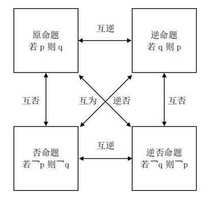

- [1 命题](#1-命题)
  - [1.1 命题的否定](#11-命题的否定)
  - [1.2 命题的其他形式](#12-命题的其他形式)
- [2 充分条件与必要条件](#2-充分条件与必要条件)
- [3 全称量词与存在量词](#3-全称量词与存在量词)

### 1 命题

把用语言、符号或式子表达的，可以判断真假的称述句叫**命题**。其中判断为真的语句叫做**真命题**，判断为假的语句叫做**假命题**。
注意：大多数命题可写为“**若$p$，则$q$**“的形式，但并不是所有都适用。

#### 1.1 命题的否定

一般地，对命题$p$加以否定，从而得到一个新命题，记作$\neg p$，读作“非$p$“或“$p$的否定“。

#### 1.2 命题的其他形式

* 原命题：若$p$，则$q$；
* 否命题：若$\neg p$，则$\neg q$；
* 逆命题：若$q$，则$p$；
* 逆否命题：若$\neg q$，则$\neg p$；
* 命题的否定：若$p$，则$\neg q$； 

> 否命题和命题的否定不是同一个东西，经常在这上面抠字眼，大家要小心。

上图可以知道，**互为逆否命题的两个命题同真假，其余的需要自行推导判断**，反证法的原理即来自于此。

### 2 充分条件与必要条件
### 3 全称量词与存在量词